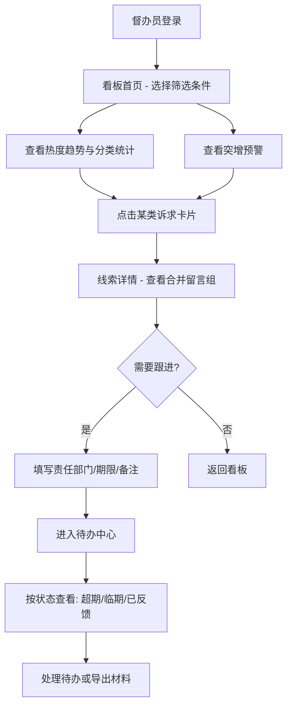

## 1. 产品概述

面向县级政务热线督办员的 Web 工作台，将热线、问政平台和本地论坛中反复出现的民生诉求集中监测与归并，帮助督办员快速识别热点、合并重复线索、跟踪办理进度，为日常舆情巡查与领导晨会提供数据支撑。

- 解决多渠道民生诉求分散、重复转派、跟进滞后的问题
- 目标用户：县级政务热线督办员、分管领导

## 2. 核心功能

### 2.1 用户角色

| 角色 | 注册方式 | 核心权限 |
|------|----------|----------|
| 督办员 | 管理员分配账号 | 筛选看板、合并线索、添加跟办、查看待办 |
| 分管领导 | 管理员分配账号 | 查看看板与待办总览、导出报表 |

### 2.2 功能模块

1. **看板首页**：多维度筛选、诉求热度变化、突增预警、分类统计
2. **线索详情页**：相似留言合并展示、原文溯源、跟办指派
3. **待办中心**：超期/临期/已反馈状态管理、快速筛选与搜索

### 2.3 页面详情

| 页面名称 | 模块名称 | 功能描述 |
|----------|----------|----------|
| 看板首页 | 顶部筛选栏 | 选择街道、时间范围（近7天/30天/自定义）、诉求类型（供水供电/道路出行/物业纠纷/教育医疗/其他），支持多选 |
| 看板首页 | 诉求热度趋势 | 按分类口径展示折线图，X轴时间、Y轴诉求量，鼠标悬浮显示具体数值 |
| 看板首页 | 分类统计卡片 | 供水供电/道路出行/物业纠纷/教育医疗/其他五大类卡片，显示当前周期诉求总量和环比变化箭头 |
| 看板首页 | 突增预警列表 | 标出诉求量环比增长超过50%的小区或路段，红色高亮，按增幅降序排列 |
| 看板首页 | 热点地图 | 以街道/小区为粒度的热力图，颜色深浅表示诉求密度 |
| 线索详情页 | 合并线索列表 | 相似留言归为一组，显示组内条数、首发时间、涉及地点标签 |
| 线索详情页 | 原文详情 | 展开每条留言的原文、来源平台图标、发布时间、涉及地点 |
| 线索详情页 | 跟办指派表单 | 添加责任部门（下拉选择）、办理期限（日期选择）、备注（文本输入），保存后进入待办 |
| 待办中心 | 状态标签页 | 超期（红色）/ 临期（橙色，3天内到期）/ 已反馈（绿色）三个标签页 |
| 待办中心 | 待办列表 | 每条显示：线索摘要、责任部门、到期日、剩余天数、状态徽标，支持按街道和部门筛选 |
| 待办中心 | 快速操作 | 一键标记已反馈、修改办理期限、查看关联线索详情 |

## 3. 核心流程

1. 督办员登录后进入看板首页，通过筛选栏选择关注街道与时间范围
2. 系统按分类展示热度趋势和统计卡片，突增预警自动标出异常小区/路段
3. 点击某类诉求卡片，进入线索详情页查看合并后的相似留言组
4. 督办员确认需要跟进的线索，填写责任部门、办理期限和备注
5. 已指派的线索进入待办中心，督办员按状态标签查看超期/临期/已反馈
6. 晨会前，督办员通过待办中心快速整理跟进情况

## 4. 用户界面设计

### 4.1 设计风格

- **主色调**：深蓝 #1B2A4A（政务稳重感），辅色 #2E7CF6（科技蓝），警示红 #E74C3C，临期橙 #F39C12，完成绿 #27AE60
- **按钮风格**：圆角6px，主要操作用实心蓝底白字，次要操作用浅蓝描边
- **字体**：标题使用 Noto Serif SC（衬线体，政务公文感），正文使用 Noto Sans SC（清晰易读）
- **布局风格**：左侧固定导航栏 + 右侧内容区，卡片式布局，留白充足
- **图标风格**：线性图标，统一2px线宽，配合蓝色系

### 4.2 页面设计概览

| 页面名称 | 模块名称 | UI 元素 |
|----------|----------|----------|
| 看板首页 | 顶部筛选栏 | 下拉多选框（街道/类型），日期范围选择器，蓝色查询按钮 |
| 看板首页 | 分类统计卡片 | 5张横向排列卡片，左图标+中数字+右环比箭头，悬浮上浮2px阴影 |
| 看板首页 | 热度趋势 | 折线图区域，浅灰网格线，分类色折线，悬浮tooltip |
| 看板首页 | 突增预警 | 右侧面板，红色脉冲圆点动画，预警条目列表，点击可跳转 |
| 看板首页 | 热点地图 | 左下区域，SVG街道轮廓热力图，深浅蓝色渐变 |
| 线索详情页 | 合并线索组 | 卡片列表，每卡左侧竖色条标识分类，右上角组内条数徽标，点击展开 |
| 线索详情页 | 原文详情 | 展开后面板，来源图标（热线/问政/论坛）、时间戳、地点标签（蓝色药丸） |
| 线索详情页 | 跟办表单 | 右侧固定面板，部门下拉、日期选择、备注文本域、蓝色保存按钮 |
| 待办中心 | 状态标签页 | 三个tab，带数字角标，当前tab蓝色下划线 |
| 待办中心 | 待办列表 | 表格行，状态色竖条，到期日倒计时文字，操作按钮组 |
| 待办中心 | 快速操作 | 行内按钮：标记反馈（绿）、修改期限（蓝）、查看详情（灰） |

### 4.3 响应式设计

- 桌面优先设计，最小宽度1280px
- 1366px以下：热点地图收起为列表视图
- 768px以下（平板）：导航栏收缩为底部tab，卡片单列排列

### 4.4 3D 场景

不适用
