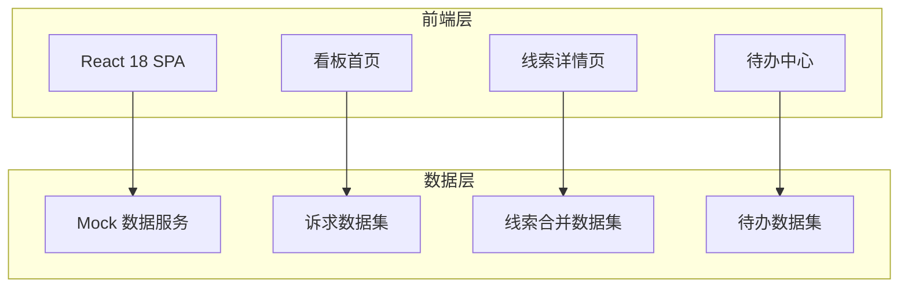
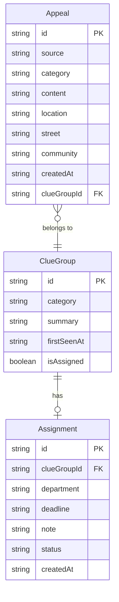

## 1. 架构设计



## 2. 技术说明

- **前端**：React@18 + TailwindCSS@3 + Vite
- **初始化工具**：Vite（react-ts 模板）
- **后端**：无后端，使用前端 Mock 数据
- **数据库**：无，所有数据以 TypeScript 常量形式内嵌
- **图表库**：Recharts（轻量 React 图表）
- **日期处理**：date-fns
- **路由**：React Router v6
- **图标**：Lucide React
- **动画**：Framer Motion

## 3. 路由定义

| 路由 | 用途 |
|------|------|
| `/` | 重定向到 /dashboard |
| `/dashboard` | 看板首页 - 筛选、热度趋势、分类统计、突增预警 |
| `/clue/:id` | 线索详情页 - 合并留言组、原文展示、跟办指派 |
| `/todo` | 待办中心 - 超期/临期/已反馈状态管理 |

## 4. API 定义

无后端 API，使用 Mock 数据。数据类型定义如下：

```typescript
interface Appeal {
  id: string
  source: 'hotline' | 'governance' | 'forum'
  category: '供水供电' | '道路出行' | '物业纠纷' | '教育医疗' | '其他'
  content: string
  location: string
  street: string
  community?: string
  createdAt: string
  clueGroupId: string
}

interface ClueGroup {
  id: string
  category: Appeal['category']
  appeals: Appeal[]
  summary: string
  firstSeenAt: string
  locations: string[]
  isAssigned: boolean
  assignment?: Assignment
}

interface Assignment {
  id: string
  clueGroupId: string
  department: string
  deadline: string
  note: string
  status: 'overdue' | 'urgent' | 'done'
  createdAt: string
  feedbackAt?: string
}

interface CategoryStat {
  category: Appeal['category']
  count: number
  change: number
}

interface AlertItem {
  id: string
  location: string
  street: string
  category: Appeal['category']
  increase: number
  currentCount: number
}
```

## 5. 服务器架构

不适用（纯前端项目）

## 6. 数据模型

### 6.1 数据模型定义



### 6.2 数据定义

使用 TypeScript 常量文件定义 Mock 数据，包含：
- 6个街道 × 5个分类 ≈ 150条诉求记录
- 约30个线索合并组
- 约15条待办记录（覆盖超期/临期/已反馈三种状态）
- 趋势数据：30天每日各分类诉求量
